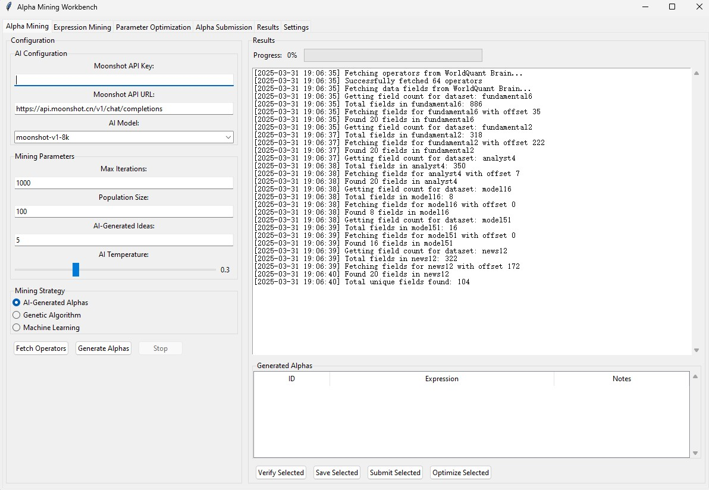
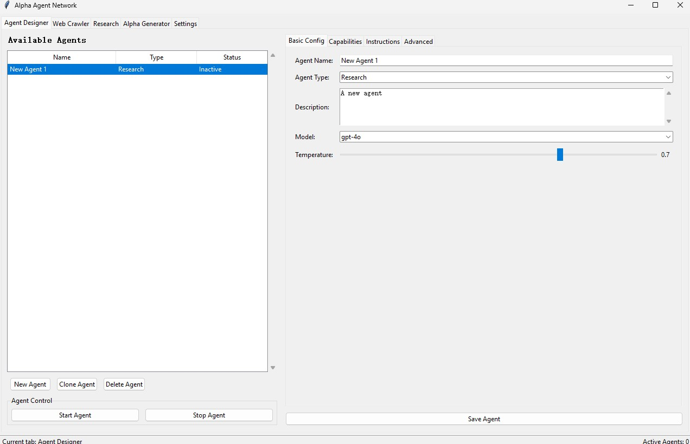
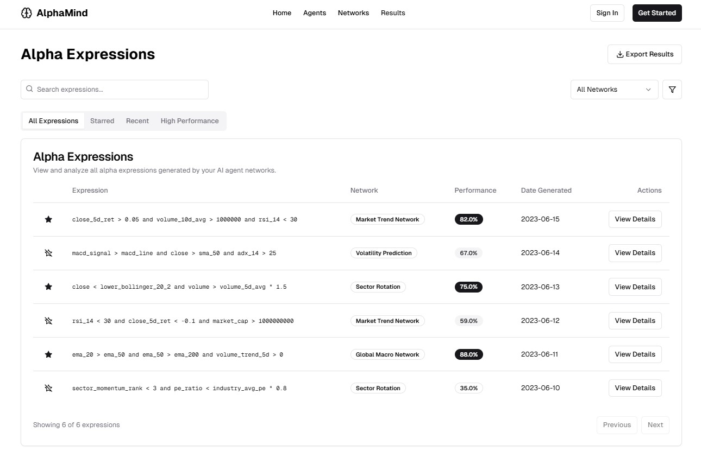

# WorldQuant Alpha Generator

This project is a collection of scripts that generate and submit alphas to the WorldQuant platform.

<!-- Beautiful ASCII  art -->


```
 __      __            .__       .___                          __            .__                     
/  \    /  \___________|  |    __| _/________ _______    _____/  |_    _____ |__| ____   ___________ 
\   \/\/   /  _ \_  __ \  |   / __ |/ ____/  |  \__  \  /    \   __\  /     \|  |/    \_/ __ \_  __ \
 \        (  <_> )  | \/  |__/ /_/ < <_|  |  |  // __ \|   |  \  |   |  Y Y  \  |   |  \  ___/|  | \/
  \__/\  / \____/|__|  |____/\____ |\__   |____/(____  /___|  /__|   |__|_|  /__|___|  /\___  >__|   
       \/                         \/   |__|          \/     \/             \/        \/     \/       
```


Discord: https://discord.gg/K8X5xu2e


# Rust Alpha Generator

This is a Rust implementation of the alpha generator.

## Installation

```bash
cargo build --release
```

## Usage

```bash
cargo run --release
```

# Python Alpha Generator

This is a Python implementation of the alpha generator.

## Pre-Consultant

### Installation

```bash
pip install -r requirements.txt
```

### Usage

```bash
python alpha_generator.py
```

```bash
python alpha_expression_miner.py --expression "expression"
```

```bash
python clean_up_logs.py
```

```bash
python successful_alpha_submitter.py
```


## Consultant

### Installation

```bash
pip install -r requirements.txt
```

### Usage

```bash
python machine_miner.py
```

# TODO
- Integrate more templates
- Integrate more datafields
- Integrate more operators
- Integrate more regions
- Integrate more universes
- Integrate more alphas

# Incoming Features
## GUI
### Introduction
- An interim solution to manage WorldQuant Alpha Generator with python GUI
### Preview

## Agent
### Preview

### Introduction
- An interim solution to manage agent networks with python GUI
## Agent site - agent-next
### Introduction
- Key Points
  - A free(as of now because it is not done jajaja) user-friendly interface to create agent networks to work with the WorldQuant Alpha Generator
  - Open source and frontend only database interactions so you can see that the website does not save your WorldQuant credentials but only your email will be used to identify you
    - You would need to first verify with WorldQuant via API then verify with the site
    - No WorldQuant credentials are saved on the server side but your email will be used to identify you
  - Login required for managing agent networks
  - Free tier available
  - Leverage vector databases to store agent memories
- Features
  - Chat with agents
  - Create agent networks
  - Manage agent networks
  - Delete agent networks
  - View agent networks
  - View agent memories

### Preview



# Contribute
## How to Contribute

We welcome contributions from the community! Here's how you can help:

### Code Contributions

1. Fork the repository
2. Create a new branch (`git checkout -b feature/improvement`)
3. Make your changes
4. Run tests to ensure nothing is broken
5. Commit your changes (`git commit -am 'Add new feature'`)
6. Push to the branch (`git push origin feature/improvement`)
7. Create a Pull Request

### Bug Reports & Feature Requests

- Use the GitHub issue tracker to report bugs
- Clearly describe the issue including steps to reproduce
- Make feature requests through GitHub issues
- Tag issues appropriately

### Documentation

- Help improve documentation
- Add code comments where needed
- Update the README with new features
- Write tutorials and examples

### Guidelines

- Follow existing code style and conventions
- Write clear commit messages
- Add tests for new features
- Update documentation for changes
- Be respectful to other contributors

### Getting Help

- Join our community chat
- Ask questions in GitHub issues
- Read existing documentation
- Check closed issues for solutions

We appreciate all contributions that help make this project better!

