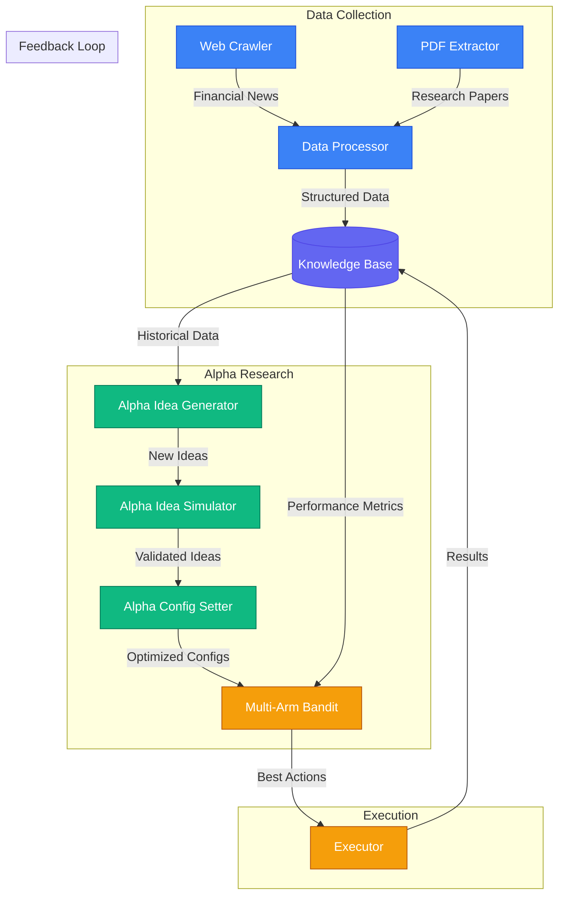
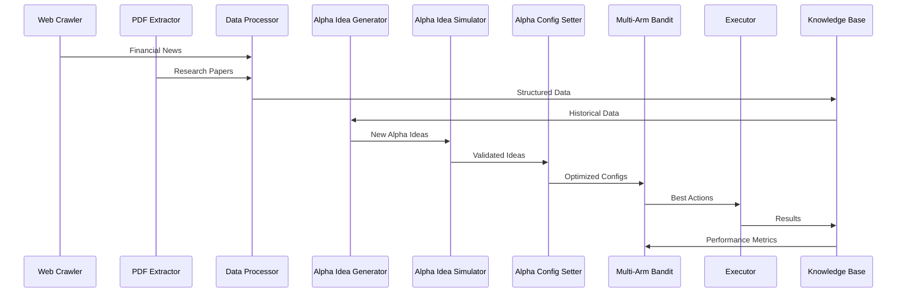

# WorldQuant Alpha Generator

This project is a collection of scripts that generate and submit alphas to the WorldQuant platform.

<!-- Beautiful ASCII  art -->


```
 __      __            .__       .___                          __            .__                     
/  \    /  \___________|  |    __| _/________ _______    _____/  |_    _____ |__| ____   ___________ 
\   \/\/   /  _ \_  __ \  |   / __ |/ ____/  |  \__  \  /    \   __\  /     \|  |/    \_/ __ \_  __ \
 \        (  <_> )  | \/  |__/ /_/ < <_|  |  |  // __ \|   |  \  |   |  Y Y  \  |   |  \  ___/|  | \/
  \__/\  / \____/|__|  |____/\____ |\__   |____/(____  /___|  /__|   |__|_|  /__|___|  /\___  >__|   
       \/                         \/   |__|          \/     \/             \/        \/     \/       
```


Discord: https://discord.gg/K8X5xu2e

Usage Tutorial(WIP) on the web version: https://www.youtube.com/watch?v=xwr9atsulSA


# Rust Alpha Generator

This is a Rust implementation of the alpha generator.

## Installation

```bash
cargo build --release
```

## Usage

```bash
cargo run --release
```

# Python Alpha Generator

This is a Python implementation of the alpha generator.

## Introduction: Difference between Pre-Consultant and Consultant

- Pre-Consultant has maximum 5 concurrent simulations
- Pre-Consultant has fewer operators and data fields options

## Pre-Consultant

This is basically a closed loop system where it starts with alpha_generator.py, which generates alpha ideas with Kimi AI. Then it dumps promising alpha to a local log file, which promising_alpha_miner.py will mine for better results, and dumps refined alpha to a local log file, which you can run successful_alpha_submitter.py to submit to the WorldQuant platform. These script can run concurrently.

While alpha_expression_miner.py is more of a utility script to mine alpha expressions from a given expression manually but not within the aforementioned closed loop system.

alpha_101_testing is currently under development.

alpha_polisher.py is currently under development.

### Installation

```bash
pip install -r requirements.txt
```

### Usage

#### Alpha Generator

The pre-consultant Python alpha generator uses Kimi AI to generate alpha expressions. Notice this may get you some alpha ideas as long as you are fine with the cost.

Human in the loop control is the future development direction of this script.


```bash
python alpha_generator.py
```

#### Alpha Expression Miner

This script is used to mine alpha expressions from a given expression.

```bash
python alpha_expression_miner.py --expression "expression"


PS ~> python .\alpha_expression_miner.py --expression "cashflow_stability = ts_mean(cashflow_op, 252) / (debt_lt + 0.01);
>> stability_z = zscore(cashflow_stability);
>> debt_ratio = debt_lt / (assets + 0.01);
>> combined_score = stability_z - zscore(debt_ratio);
>> -rank(combined_score)"
2025-05-04 01:37:50,111 - INFO - Starting alpha expression mining with parameters:
2025-05-04 01:37:50,111 - INFO - Expression: cashflow_stability = ts_mean(cashflow_op, 252) / (debt_lt + 0.01);
stability_z = zscore(cashflow_stability);
debt_ratio = debt_lt / (assets + 0.01);
combined_score = stability_z - zscore(debt_ratio);
-rank(combined_score)
2025-05-04 01:37:50,111 - INFO - Output file: mined_expressions.json
2025-05-04 01:37:50,112 - INFO - Initializing AlphaExpressionMiner
2025-05-04 01:37:50,112 - INFO - Loading credentials from ./credential.txt
2025-05-04 01:37:50,112 - INFO - Authenticating with WorldQuant Brain...
2025-05-04 01:37:51,303 - INFO - Authentication response status: 201
2025-05-04 01:37:51,303 - INFO - Authentication successful
2025-05-04 01:37:51,303 - INFO - Parsing expression: cashflow_stability = ts_mean(cashflow_op, 252) / (debt_lt + 0.01);
stability_z = zscore(cashflow_stability);
debt_ratio = debt_lt / (assets + 0.01);
combined_score = stability_z - zscore(debt_ratio);
-rank(combined_score)
2025-05-04 01:37:51,303 - INFO - Found 3 parameters to vary

Found the following parameters in the expression:
1. Value: 252.0 | Context: ...s_mean(cashflow_op, 252) / (debt_lt + 0.01)...
2. Value: 0.01 | Context: ..., 252) / (debt_lt + 0.01);
stability_z = zsc...
3. Value: 0.01 | Context: ...debt_lt / (assets + 0.01);
combined_score = ...

Enter the numbers of parameters to vary (comma-separated, or 'all'): all

Parameter: 252.0 | Context: ...s_mean(cashflow_op, 252) / (debt_lt + 0.01)...
Enter range (e.g., '10' for ±10, or '5,15' for 5 to 15): 25
Enter step size: 1

Parameter: 0.01 | Context: ..., 252) / (debt_lt + 0.01);
stability_z = zsc...
Enter range (e.g., '10' for ±10, or '5,15' for 5 to 15): -0.05,0.05
Enter step size: 0.01

Parameter: 0.01 | Context: ...debt_lt / (assets + 0.01);
combined_score = ...
Enter range (e.g., '10' for ±10, or '5,15' for 5 to 15): -0.05,0.05
Enter step size: 0.01
2025-05-04 01:38:18,371 - INFO - Generating variations based on selected parameters
2025-05-04 01:38:18,375 - INFO - Generated 5100 total variations
2025-05-04 01:38:18,376 - INFO - Testing variation 1/5100: cashflow_stability = ts_mean(cashflow_op, 227) / (debt_lt + -0.05);
stability_z = zscore(cashflow_stability);
debt_ratio = debt_lt / (assets + -0.05);
combined_score = stability_z - zscore(debt_ratio);
-rank(combined_score)
2025-05-04 01:38:18,376 - INFO - Testing alpha: cashflow_stability = ts_mean(cashflow_op, 227) / (debt_lt + -0.05);
stability_z = zscore(cashflow_stability);
debt_ratio = debt_lt / (assets + -0.05);
combined_score = stability_z - zscore(debt_ratio);
-rank(combined_score)
2025-05-04 01:38:18,754 - INFO - Simulation creation response: 201

```

#### Clean Up Logs

This script is used to clean up the logs.

```bash
python clean_up_logs.py
```

#### Successful Alpha Submitter

This script is used to submit successful alphas to the WorldQuant platform. It's not recommended to use this script as of now because it submits alphas in one batch instead of once per day.

```bash
python successful_alpha_submitter.py
```

## Pre-Consultant Non-AI
The `machine_lib.py` module provides core functionality for alpha generation and testing through the WorldQuant platform. Here are the key components:

### WorldQuantBrain Class
The main class that handles interactions with WorldQuant's API and alpha generation logic:

- Authentication and session management with WorldQuant platform
- Fetching and processing data fields (matrix and vector types)
- Generating alpha expressions using operators and data fields
- Running simulations to test alpha performance
- Processing and analyzing simulation results

### Key Features
- Automated alpha generation using combinations of:
  - Data fields (matrix and vector types)
  - Mathematical operators (+, -, *, /, etc.)
  - Ranking and scoring functions
  - Time series operations
- Simulation capabilities:
  - Single alpha testing
  - Batch simulation support
  - Performance metrics calculation
- Result processing:
  - Filtering based on performance thresholds
  - Storing successful alphas
  - Error handling and logging

### Data Processing
- Data field categorization (matrix vs vector)
- Expression validation
- Performance metric calculations:
  - Information Ratio (IR)
  - Returns
  - Turnover
  - Correlation analysis

The library serves as the foundation for automated alpha mining and testing, providing the necessary tools to interact with WorldQuant's platform programmatically.

```bash
python machine_miner.py --username your_worldquant_username --password your_worldquant_password
```


## Consultant

Just like the pre-consultant non ai but without workaround like single simulation and skip for inaccessible data fields and operators.


### Installation

```bash
pip install -r requirements.txt
```

### Usage

```bash
python machine_miner.py --username your_worldquant_username --password your_worldquant_password
```

# TODO
- Integrate more templates
- Integrate more datafields
- Integrate more operators
- Integrate more regions
- Integrate more universes
- Integrate more alphas

# Incoming Features
## GUI
### Introduction
- An interim solution to manage WorldQuant Alpha Generator with python GUI
### Preview

## Agent
### Preview

### Introduction
- An interim solution to manage agent networks with python GUI
## Agent site - agent-next
### Introduction
- Key Points
  - A free(as of now because it is not done jajaja) user-friendly interface to create agent networks to work with the WorldQuant Alpha Generator
  - Open source and frontend only database interactions so you can see that the website does not save your WorldQuant credentials but only your email will be used to identify you
    - You would need to first verify with WorldQuant via API then verify with the site
    - No WorldQuant credentials are saved on the server side but your email will be used to identify you
  - Login required for managing agent networks
  - Free tier available
  - Leverage vector databases to store agent memories
- Features
  - Chat with agents
  - Create agent networks
  - Manage agent networks
  - Delete agent networks
  - View agent networks
  - View agent memories
  - Alpha Polisher - Polish existing alphas or generate new ideas using AI

### Preview


## A2A Protocol Implementation
### Introduction
- Key Points
  - Implementation of Agent-to-Agent (A2A) protocol for automated financial research
  - Prescriptive agent architecture mimicking real-world financial analyst workflows
  - Integration with existing WorldQuant Alpha Generator components
  - Automated alpha mining pipeline with specialized agents

### Architecture


- **Data Collection Agents**
  - Web Crawler Agent: Automated financial news and market data collection
  - PDF Extractor Agent: Research paper processing and information extraction
  - Data Processor Agent: Data transformation and knowledge base management

- **Alpha Research Agents**
  - Alpha Idea Generator Agent: Pattern recognition and idea generation
  - Alpha Idea Simulator Agent: Validation and testing of alpha ideas
  - Alpha Config Setter Agent: Parameter optimization and configuration

- **Execution Agents**
  - Multi-Arm Bandit Agent: Reinforcement learning for action selection
  - Executor Agent: Implementation and monitoring of selected actions

### Communication Flow


### Features
- Automated research workflow orchestration
- Structured data exchange between agents
- Performance feedback loops
- Knowledge base integration
- Real-time progress tracking
- Priority-based task scheduling

### Integration with Existing Components
- Vector database integration for agent memories
- API integration with WorldQuant platform
- Web interface for monitoring and control
- Automated alpha submission pipeline

### Future Enhancements
- Advanced natural language processing for research paper analysis
- Machine learning models for pattern recognition
- Automated hypothesis generation and testing
- Real-time market data integration
- Performance optimization and scaling
- Enhanced error handling and recovery mechanisms

# Contribute
## How to Contribute

We welcome contributions from the community! Here's how you can help:

### Code Contributions

1. Fork the repository
2. Create a new branch (`git checkout -b feature/improvement`)
3. Make your changes
4. Run tests to ensure nothing is broken
5. Commit your changes (`git commit -am 'Add new feature'`)
6. Push to the branch (`git push origin feature/improvement`)
7. Create a Pull Request

### Bug Reports & Feature Requests

- Use the GitHub issue tracker to report bugs
- Clearly describe the issue including steps to reproduce
- Make feature requests through GitHub issues
- Tag issues appropriately

### Documentation

- Help improve documentation
- Add code comments where needed
- Update the README with new features
- Write tutorials and examples

### Guidelines

- Follow existing code style and conventions
- Write clear commit messages
- Add tests for new features
- Update documentation for changes
- Be respectful to other contributors

### Getting Help

- Join our community chat
- Ask questions in GitHub issues
- Read existing documentation
- Check closed issues for solutions

We appreciate all contributions that help make this project better!

# Dify Components Integration

This project integrates components from Dify (agent-dify-api and agent-dify-web) for enhanced alpha mining capabilities. These components are used under the Apache License 2.0.

## Legal Notice

The Dify components (agent-dify-api and agent-dify-web) are licensed under the Apache License 2.0. This means:

1. You may use, reproduce, and distribute the Dify components
2. You may modify and create derivative works
3. You must include the original copyright notice
4. You must state significant changes made to the original software
5. You must include a copy of the Apache License 2.0

For the complete terms and conditions, please refer to the [Apache License 2.0](https://www.apache.org/licenses/LICENSE-2.0).

## Usage of Dify Components

The Dify components are integrated into this project to enhance alpha mining capabilities:

1. **agent-dify-api**: Provides API endpoints for alpha generation and mining
2. **agent-dify-web**: Offers a web interface for alpha mining operations

### Integration with Alpha Mining

The Dify components are used to:
- Generate and validate alpha expressions
- Process and analyze market data
- Provide a user-friendly interface for alpha mining
- Enable automated alpha generation and submission

### Attribution

This project uses components from Dify, which are licensed under the Apache License 2.0. The original copyright notices and license information are preserved in the respective component directories.

## License

This project is licensed under the Apache License 2.0 - see the [LICENSE](LICENSE) file for details.

## Tutorial: Using Dify Components for Alpha Mining

### Prerequisites
1. Docker and Docker Compose installed
2. Python 3.8 or higher
3. Node.js 16 or higher (for web interface)

### Setting Up Dify Components

1. **Start the Dify Services**
```bash
# Start the Dify API and Web services
docker-compose -f docker-compose.middleware.yaml up -d
```

2. **Verify Services**
```bash
# Check if services are running
docker ps
```

### Using the Dify Web Interface

1. **Access the Web Interface**
   - Open your browser and navigate to `http://localhost:3000`
   - Log in with your credentials

2. **Creating Alpha Mining Tasks**
   - Click on "New Task" in the web interface
   - Select "Alpha Mining" as the task type
   - Configure your mining parameters:
     - Data fields to use
     - Time period
     - Universe selection
     - Mining strategy

3. **Monitoring Mining Progress**
   - View real-time mining progress in the dashboard
   - Check generated alphas in the "Results" section
   - Export successful alphas for submission

### Using the Dify API

1. **API Authentication**
```python
import requests

API_URL = "http://localhost:8000"
headers = {
    "Authorization": "Bearer your_api_key"
}
```

2. **Creating Mining Tasks**
```python
# Create a new mining task
response = requests.post(
    f"{API_URL}/api/v1/mining/tasks",
    headers=headers,
    json={
        "name": "My Mining Task",
        "data_fields": ["close", "volume", "high", "low"],
        "time_period": "1Y",
        "universe": "US",
        "strategy": "correlation"
    }
)
```

3. **Checking Task Status**
```python
# Get task status
task_id = response.json()["task_id"]
status = requests.get(
    f"{API_URL}/api/v1/mining/tasks/{task_id}",
    headers=headers
)
```

4. **Retrieving Results**
```python
# Get mining results
results = requests.get(
    f"{API_URL}/api/v1/mining/tasks/{task_id}/results",
    headers=headers
)
```

### Best Practices

1. **Resource Management**
   - Monitor system resources during mining
   - Adjust mining parameters based on available resources
   - Use appropriate timeouts for long-running tasks

2. **Error Handling**
   - Implement proper error handling in your API calls
   - Check task status regularly
   - Save intermediate results

3. **Performance Optimization**
   - Use appropriate batch sizes
   - Implement caching where possible
   - Monitor and adjust mining parameters

### Troubleshooting

1. **Service Issues**
   - Check Docker container logs: `docker logs <container_id>`
   - Verify service health: `docker-compose ps`
   - Restart services if needed: `docker-compose restart`

2. **API Issues**
   - Verify API endpoint availability
   - Check authentication tokens
   - Monitor API rate limits

3. **Mining Issues**
   - Verify data field availability
   - Check universe configuration
   - Monitor memory usage

For more detailed information about specific features and configurations, refer to the [Dify Documentation](https://docs.dify.ai).

